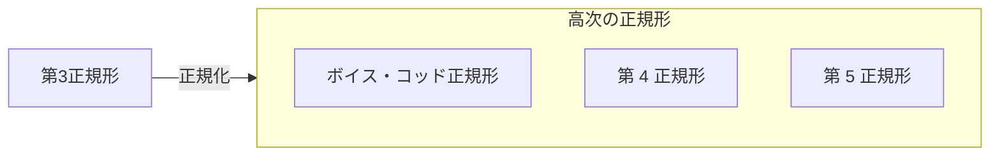

# 正規化

## 正規化とは？

関係（リレーション）をルールに従って分解すること

## 目的

- タプルの更新時に起こる **更新時異状** を排除すること（「分解する」という言い回しもされている）

- 整合性の取れたデータベースを作成すること

## 正規化の種類

- 第 1 正規形
- 第 2 正規形
- 第 3 正規形
- ボイス・コッド正規形
- 第 4 正規形
- 第 5 正規形

## 正規化の順序

## 正規化と正規形の違いは？

- 正規化: 関係（リレーション）をルールに従って分解すること

- 正規形: 正規化を行うことで出来上がる関係（リレーション）のこと

## 情報無損失分解をわかりたい

### 字面がパッと見いかついので分解して考える
- 「情報」: 関係（リレーション）を指している

- 「無損失」: 失われていないことを指してる。ので、関係（リレーション）の情報が失われていないことを指してる

- 「分解」: 正規化を指している

- 「情報無損失分解」とは？

  - 「関係（リレーション）の情報が失われないように正規化すること」かと思う

  - 次に why, how が知りたい

### なぜ情報無損失分解をやる？

- 結論、「正規化による分解後でも、関係（リレーション）同士を自然結合することで復元できるようにしておく」ため

- 情報無損失分解でない場合は、上記は達成でいないのか？

  - 情報無損失分解をせずに適当に分解すると、その過程で関係（リレーション）の情報が失われ、復元できなくなる可能性がある

### 情報無損失分解ってどうやるの？

ちゃんと第１正規形から順番に正規化してくこと

### 情報無損失分解が言いたいことは？

正規化後でも復元できるようにしたいけど、 
適当に正規化するとリレーションのデータが失われて復元できなくなっちゃうので、 
第１正規形から順番に正規化していきましょう
